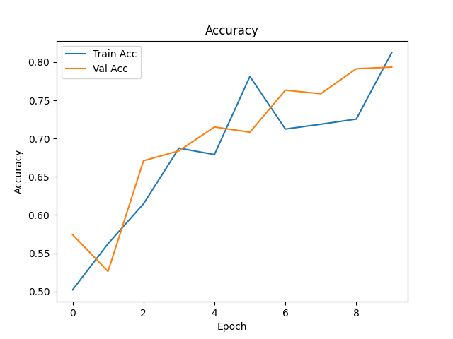
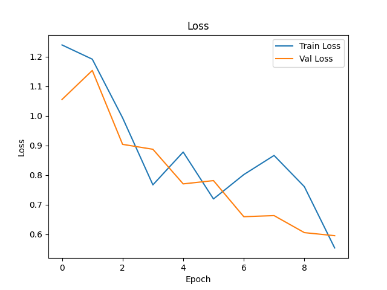
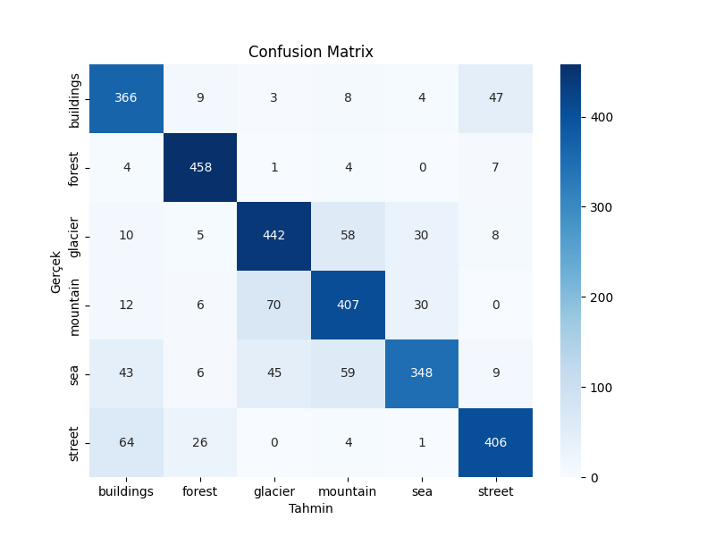

# akbank-dl-bootcamp-project
# Intel Image Classification
Akbank Derin Öğrenme Bootcamp CNN Image Classification Project
## 📘 Proje Açıklaması

Bu proje, Intel'in görüntü veri setini kullanarak sınıflandırma yapmayı amaçlamaktadır. Derin öğrenme modelleri kullanılarak, farklı sınıflara ait görüntüler tanımlanmıştır.

## 🧪 Kullanılan Yöntemler

- *Model:* ResNet50
- *Optimizasyon:* Adam Optimizer
- *Kayb Fonksiyonu:* Sparse Categorical Crossentropy
- *Epoch Sayısı:* 10

## 📈 Sonuçlar

### Accuracy ve Loss Grafikleri

### Confusion Matrix

### Classification Report
Classification Report:

              precision    recall  f1-score   support

   buildings       0.73      0.84      0.78       437
      forest       0.90      0.97      0.93       474
     glacier       0.79      0.80      0.79       553
    mountain       0.75      0.78      0.76       525
         sea       0.84      0.68      0.75       510
      street       0.85      0.81      0.83       501

    accuracy                           0.81      3000
   macro avg       0.81      0.81      0.81      3000
weighted avg       0.81      0.81      0.81      3000

## Test Seti Sonuçları

Modelin test veri seti üzerindeki performansı:

- *Test Loss:* 0.5542 
- *Test Accuracy:* 0.8090
## 🔍 Grad-CAM Görselleştirmesi

Aşağıda, modelin tahmin yaparken hangi bölgelere odaklandığını gösteren Grad-CAM çıktısı yer almaktadır. Görsel, test verisinden alınan bir örnek üzerinde oluşturulmuştur ve modelin karar mekanizmasını görselleştirmektedir.

  ### Notebook
Projeyi adım adım görmek için [notebook dosyasına buradan](notebooks/intel_image_classification.ipynb) ulaşabilirsiniz.

 ### Linkler
https://www.kaggle.com/code/hayrunnisasar/akbank-derin-renme-notebook/edit 

